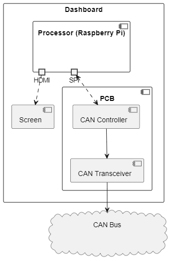
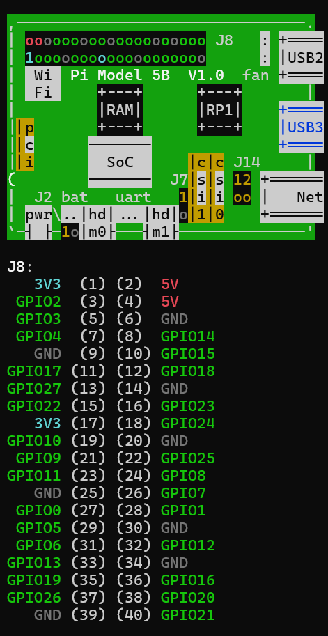

# Compose Dashboard

## Table of Contents
1. **[Overview](#overview)**
2. **[Requirements](#requirements)**
   1. [Raspberry Pi](#raspberry-pi)
   2. [Your Computer](#your-computer)
3. **[Access](#access)**
   1. [Enabling SSH](#enabling-ssh)
   2. [Configurations](#configurations)
   3. [Connecting over WiFi](#connecting-over-wifi)
   4. [Connecting over Ethernet](#connecting-over-ethernet)
   5. [GitHub Authentication](#github-authentication)
   6. [Programming Remotely](#programming-remotely)
4. **[Architecture](#architecture)**
   1. [Hardware](#hardware)
   2. [Software](#software)
5. **[Integration](#integration)**
   1. [Wiring](#wiring)
   2. [Enabling SPI](#enabling-spi)
   3. [Installing Drivers](#installing-drivers)

## Overview

This project is an **automotive dashboard application** built using 
[**Kotlin**](https://kotlinlang.org/) 
and
[**Compose Multiplatform**](https://www.jetbrains.com/compose-multiplatform/),
and designed for the Raspberry Pi 5. The dashboard aims to provide 
visualisation for data received from sensors on the vehicle using CAN bus 
communication.

## Requirements

Kotlin targets the
[JVM](https://en.wikipedia.org/wiki/Java_virtual_machine),
and compiles to Java bytecode, hence this application has similar dependencies
to most Java-based projects. Note that you need to set the `JAVA_HOME` 
environment variable to the file path of the **correct JDK/JRE** for the Pi or 
your computer if it is already set to a different Java version. 

### Raspberry Pi

UBC Baja utilises a 
[Raspberry Pi 5](https://www.raspberrypi.com/products/raspberry-pi-5/) 
running the official
[Raspberry Pi OS](https://www.raspberrypi.com/software/operating-systems/#raspberry-pi-os-64-bit),
which is a derivative of
[Debian 12 (Bookworm)](https://wiki.debian.org/DebianBookworm). 
To run the application on the physical dashboard, ensure the following is 
set-up on the Pi:
- Install
  [JRE 17](https://packages.debian.org/bookworm/openjdk-17-jre),
  the default (and latest _stable_) version of Java for Bookworm (as of January 
  2025). It is worth noting that only the Java _Runtime_ is mandatory to _run_ 
  the application. Ensure that the `JAVA_HOME` variable is set correctly.
- The Raspberry Pi 5 may have compatibility issues with the rendering of the 
  Compose libraries. Set the environment variable on the Pi as shown 
  [here](https://github.com/JetBrains/skiko/issues/838#issuecomment-1997275861), 
  and run the following command in the Pi shell.
  - `export SKIKO_RENDER_API=SOFTWARE`
  
### Your Computer

- Install 
  [JDK 17](https://www.oracle.com/ca-en/java/technologies/downloads/)
  for your operating system.
- (optional) Download
  [IntelliJ IDEA](https://it.ubc.ca/services/desktop-print-services/software-licensing/free-open-source-software),
  an IDE with built-in support for Java and Kotlin development. This software is
  developed by JetBrains (the company that created Kotlin), and as UBC students,
  we get free access to IntelliJ IDEA Ultimate.

## Access

The Raspberry Pi can be interfaced with directly using the USB ports (or 
Bluetooth) to connect a mouse and keyboard.

Additionally, the Pi can be accessed using the
[SSH](https://en.wikipedia.org/wiki/Secure_Shell)
protocol by simply connecting the Pi to your computer and accessing it remotely 
through the terminal. Developers should be comfortable with utilising the 
command-line interface.

### Enabling SSH

The Raspberry Pi does not have the SSH protocol enabled by default. If the
device is reset, the protocol must be re-enabled.

1. [Connect to the Raspberry Pi](#access).
2. To open the device configurations, run:
   ```
   sudo raspi-config
   ```
3. Use the arrow keys to select `3 Interface Options`.
4. Again, use the arrow keys to select `SSH`.
5. Follow the directions to enable and reboot the device.

### Configurations

The passwords and addresses to access the Pi via SSH is configured as:

key|value
:-:|:-:
`username`|ubcbaja
`hostname`|bajapi.local
`address` |192.168.1.2
`password`|juanisabozo

Enter the password when prompted.

### Connecting over WiFi

When the Raspberry Pi 5 and your computer are connected to the **same** wireless
network, the Pi can be accessed through LAN by entering the following in your
terminal:
```
ssh [username]@[hostname]
```
> This **does not work** through mobile hotspots or any of UBC's networks.

### Connecting over Ethernet

When connected to the Raspberry Pi with an ethernet cable, you can connect to
the Pi's static IP address by entering the following in your terminal:
```
ssh [username]@[address]
```
Because this only requires a physical connection, this can also be used on the
field.

### GitHub Authentication

When utilising GitHub through the Raspberry Pi over SSH, because it is a
**shared** device, please remember to **delete SSH keys**, and re-configure your
GitHub settings when/if you leave the team. You can create SSH keys by following
[this guide](https://gist.github.com/xirixiz/b6b0c6f4917ce17a90e00f9b60566278).

### Programming Remotely

Because the Raspberry Pi can be accessed using SSH, firmware can be modified,
launched, or created by utilising terminal-based text editors. Currently, the
installed text editors are
[nano](https://www.nano-editor.org/)
and
[vim](https://www.vim.org/).

As the text editors are installed on the Pi itself, do not modify the `.bashrc`
or `.vimrc` configuration files without documenting the changes, as they will
adjust the settings for everyone programming directly through SSH.

> The line `export DISPLAY=:0` in the `.bashrc` file configures applications to
> display on the screen connected to the Pi, and _not_ your computer screen.

## Architecture

### Hardware

The dashboard contains three components: the screen that displays the user-interface, the processor that handles computations (Raspberry Pi), and the dashboard PCB which enables the dashboard to be powered and connected to the CAN bus.

<p align="center">
  
</p>

As the CAN controllers interfaces with the Raspberry Pi via the SPI protocol,
all CAN communication is accomplished by standard SPI read or write operations.

### Software

> All Kotlin (`*.kt`) files are relative to the directory `src/main/kotlin`
> unless specified.

The dashboard application uses Compose Multiplatform, which is a framework for 
Kotlin user-interface (UI) development which enables targeting different 
platforms, including Unix or Windows systems. Compose follows a
[declarative UI programming](https://docs.flutter.dev/get-started/flutter-for/declarative) 
style, hence the contents of the screen are produced as a function of the UI's 
state, rather than being constructed component by component.

## Integration

The Raspberry Pi 5 has the following pinout:

<p align="center">
  
</p>

> This can be found by entering `pinout` in the Raspberry Pi command-line.

### Wiring

The CAN controller utilised in the dashboard PCB is the
[MCP2515](https://ww1.microchip.com/downloads/en/DeviceDoc/MCP2515-Stand-Alone-CAN-Controller-with-SPI-20001801J.pdf),
which uses an SPI interface. The table below outlines the wiring configuration
for the Raspberry Pi to CAN controller interface.

|**Raspberry Pi GPIO**|**MCP2515 IO**|**Function**|
|-|-|-|
|GPIO10 (Pin 19)|SI |MOSI       |
|GPIO9 (Pin 21) |SO |MISO       |
|GPIO11 (Pin 23)|SCK|Clock      |
|GPIO25 (Pin 22)|INT|Interrupt  |
|GPIO8 (Pin 24) |CS |Chip Select|

### Enabling SPI

The Raspberry Pi does not have the SPI protocol enabled by default. If the
device is reset, the protocol must be re-enabled. See the section on
[enabling SSH](#enabling-ssh).

After enabling, enter `ls /dev/*spi*` into the terminal. The Pi should output:
```
/dev/spidev0.0  /dev/spidev0.1
```

### Installing Drivers

> This section is derived from 
> [BeyondLogic](https://www.beyondlogic.org/adding-can-controller-area-network-to-the-raspberry-pi/).
> See the full article for more context.

In order to communicate with the MCP2515 CAN controller on the dashboard PCB,
the Pi must be configured with the correct drivers that will enable it to
communicate.

> `{crystal frequency}` and `{bit rate}` are placeholders for the
> crystal frequency value for the dashboard PCB, as well as the CAN bit rate
> respectively. The bit rate should be the frequency that all CAN modules adhere
> to.

1. Edit the boot file for the Pi to initialise the CAN controller on boot. 
   ```
   sudo vim ~/../../boot/firmware/config.txt
   ```
2. Add the device configuration to the file.
   ```
   dtoverlay=mcp2515-can0,oscillator={crystal frequency},interrupt=25
   ```
3. Then, reboot the Raspberry Pi and check the kernal messages to verify 
   initialisation.
   ```
   dmesg | grep "mcp"
   ```
   This should return with a successful initialisation message.
   ```
   mcp251x spi0.0 can0: MCP2515 successfully initialized.
   ```
4. Then, set up the CAN interface to start the CAN communication.
   - To start it manually, enter: 
     ```
     sudo /sbin/ip link set can0 up type can bitrate {bit rate}
     ```
   - To enable automatic initialisation, edit the network interfaces file.
     ```
     sudo vim ~/../../etc/network/interfaces
     ```
     Then, add the following to the configuration file:
     ```
     auto can0
     iface can0 inet manual
		     pre-up /sbin/ip link set can0 type can bitrate {bit rate} triple-sampling on restart-ms 100
		     up /sbin/ifconfig can0 up
		     down /sbin/ifconfig can0 down
     ```
5. To check the state of the CAN interface, run `ifconfig`.